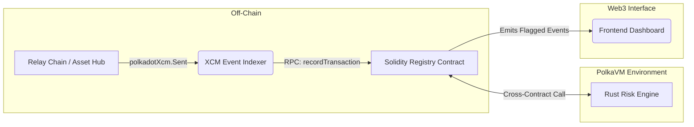

# ParaTrace – Cross-Chain Transaction Monitoring & Compliance Protocol

ParaTrace is a native cross-chain transaction monitoring and automated compliance protocol built for interoperable blockchain ecosystems like Polkadot. It observes XCM (Cross-Consensus Messaging) asset movements, evaluates wallet behaviors, and automatically flags suspicious transactions in real time using a hybrid Solidity and Rust smart contract architecture on the PolkaVM.

---

## 🚀 Deployed Links

- **Frontend Dashboard:** [https://para-trace-rm.vercel.app/](https://para-trace-rm.vercel.app/)
- **Indexer API / Listening Service (Always-On):** [https://paratrace.onrender.com/](https://paratrace.onrender.com/)
- **Indexer Health Endpoint:** [https://paratrace.onrender.com/health](https://paratrace.onrender.com/health)
- **Registry Contract (Solidity via pallet-revive):** `0xbA686106E15b9b27407b94Cb51bf734705cAF80a`
- **Risk Engine (Rust/ink! on PolkaVM):** `0x77D5f9f09f02871B918Cb2F5430F9A91004f76c4`

---

## 🚨 The Problem

Modern multi-chain ecosystems allow users to seamlessly move assets across different blockchains. While interoperability unlocks massive liquidity and utility, it introduces critical security blind spots:

* **Cross-Chain Money Laundering ("Chain Hopping"):** Malicious actors hide the origin of stolen funds by rapidly transferring assets across multiple networks using XCM, making the transaction trail incredibly complex to follow.
* **Fragmented Visibility:** Traditional EVM scanners and passive analytics tools are isolated to single chains. They fail to parse native cross-chain text payloads or correlate events spanning multiple networks.
* **Delayed Response Times:** Existing solutions are mostly passive analytics platforms. By the time a suspicious multi-chain route is manually identified, the funds have already moved. 

As transactions occur in seconds, a real-time, cross-chain, automated tracking system natively integrated into the blockchain is an absolute necessity.

---

## 🛡️ The Solution

ParaTrace resolves these blind spots by introducing an **Automated On-Chain Risk Oracle**. Instead of analyzing transactions in isolation, ParaTrace aggregates cross-chain data, calculates behavioral risk safely on-chain, and empowers parachain DeFi protocols to block malicious transactions automatically.

### Architecture & Data Flow



### Core Components

---

## 🚀 Challenges & Solutions

Developing ParaTrace involved overcoming significant technical hurdles, including **Next.js 16 (Turbopack) compatibility with Polkadot.js**. We resolved this through automated AST/source patching to sanitize legacy octal escape sequences.

Detailed technical breakdowns and our engineering solutions can be found in [CHALLENGES.md](CHALLENGES.md).

---

## 🏗️ Technical Architecture (Polkadot Track 2 / PolkaVM)

ParaTrace is architected to showcase the power of Polkadot's next-generation execution environment (**PolkaVM**):

### 1. PolkaVM & RISC-V Advantage (PVM-Experiments)
The **Risk Engine** is built using **ink! 6.0** and targets the **RISC-V** instruction set. This allows ParaTrace to perform complex algorithmic computations (like the multi-factor risk scoring) at speeds orders of magnitude faster than a standard EVM-based VM, with significantly lower gas consumption. This demonstrates the potential of **PVM-experiments** where **Rust/ink! libraries are called from Solidity** via `pallet-revive`.

### 2. Polkadot Native Functionality
ParaTrace is designed to be deeply integrated with the Polkadot ecosystem:
- **XCM Event Parsing:** The indexer and contracts are built to handle native **XCM messages**, tracking asset movements across the relay chain and parachains (e.g., Asset Hub).
- **Native Assets:** While using Ethereum-compatible addresses for the registry, ParaTrace tracks movements of **DOT/PAS** and other native assets across the multi-chain environment.
- **Future-Ready Precompiles:** The architecture is built to leverage **Polkadot precompiles** (like `0x...421`) for optimized access to chain-level metadata and XCM instructions in future iterations.

### 3. Stateless Smart Contracts
To maximize the efficiency of the Polkadot ecosystem, the Risk Engine is designed as a **stateless** contract. It holds no storage and returns calculations directly. This architecture:
- Minimizes state-rent and storage costs.
- Allows for horizontal scaling across different parachains.
- Enables the "Compute Chain" pattern where heavy logic is offloaded to highly efficient Rust/ink! contracts.

### 4. Cross-VM Interop
Using the `pallet-revive` bridge, the **Solidity-based Registry** (managing state and wallet identities) communicates with the **Rust-based Risk Engine** (calculating risk). This bridge translates EVM calls into RISC-V execution, demonstrating a unified dApp that bridges Polkadot's legacy and future.

---

### Core Components

1. **XCM Event Indexer (`indexer/`)**  
   A production Node.js indexing service running continuously at [https://paratrace.onrender.com/](https://paratrace.onrender.com/). It maintains live WebSocket subscriptions to Westend Relay, Asset Hub (Westend), Bridge Hub (Westend), and Coretime (Westend); parses finalized XCM-related events (`polkadotXcm.Sent`, assets, balances); normalizes Substrate accounts into EVM-compatible addresses for contract writes; and calls the Registry's `recordTransaction(...)` function for sender/receiver risk tracking in near real-time.
   
   The service exposes operational endpoints:
   - `GET /` for status metadata
   - `GET /health` for uptime and readiness checks

2. **Solidity Registry (`contracts-solidity/`)**  
   The primary on-chain Oracle compiled via `pallet-revive`. It manages highly optimized, gas-packed wallet profiles to track historical behavior. When new indexer data arrives, it serves as the gatekeeper, requesting a risk assessment from the Risk Engine. If a wallet's risk goes beyond a safe threshold, the Registry flags it and emits events.

3. **Rust Risk Engine (`contracts-rust/`)**  
   A high-performance `ink! 6.0` smart contract optimized for the **PolkaVM (RISC-V)** architecture.
   - **Stateless Execution:** By design, the contract eliminates all storage reads/writes (`#[ink(storage)]` is empty), enabling intensive risk computation with negligible gas costs.
   - **RISC-V Performance:** Leverages the native execution speeds of PolkaVM, allowing complex multi-factor scoring (volume, velocity, chain diversity) that would be cost-prohibitive on traditional EVM.
   - **Solidity Interoperability:** Configured with `abi = "sol"` in the metadata, facilitating seamless cross-VM calls between the Solidity Registry and the Rust Risk Engine.

4. **Frontend Dashboard (`frontend-dashboard/`)**  
   A modern Next.js/React interface plotting the flow of cross-chain assets. It provides real-time visualizations of network status, dynamic risk gauges, and a continuous feed of flagged high-risk wallets for compliance officers or public transparency.

5. **Local Network Testing (Zombienet)**
   To test interoperability quickly, we utilize a lightweight **Zombienet** configuration to spin up a local test environment running a Relay Chain, Asset Hub, and an `eth-rpc` translation node.

---

## ⚙️ Setup & Execution Guide

### Prerequisites
* Node.js (v18+)
* Polkadot binaries & Zombienet installed locally (v0.3.4+)
* `eth-rpc` (Substrate → EVM adapter)

### 1. Start the Local Development Stack (Zombienet)
First, launch the underlying testnet mapping out your Relay chain, Asset Hub, and the EVM adapter (exposed on port 8545):
```bash
cd zombienet
bash start-local-stack.sh
```

### 2. Deploy the Smart Contracts
You must deploy the Rust Risk Engine first, followed by the Solidity Registry so it can link correctly:
```bash
cd contracts-solidity
npm install

# Deploy the compute-heavy Risk Engine (Rust/ink!)
npx hardhat run scripts/deployRiskEngine.ts --network zombienet

# Deploy the Solidity Registry, passing the Risk Engine's address
npx hardhat ignition deploy ignition/modules/ParaTrace.ts \
  --network zombienet \
  --parameters '{"ParaTraceModule":{"riskEngineAddress":"<INSERT_RISK_ENGINE_ADDRESS_HERE>"}}'
```

### 3. Spin up the Event Indexer
The production indexer is already live and always available at [https://paratrace.onrender.com/](https://paratrace.onrender.com/).

For local development, run your own indexer instance to monitor XCM transactions and write risk updates to your deployed registry:
```bash
cd indexer
npm install
# Make sure your .env has REGISTRY_CONTRACT_ADDRESS matching step 2
npm start
```

You can verify local/service health via:
- [https://paratrace.onrender.com/health](https://paratrace.onrender.com/health) (production)
- `http://localhost:3000/health` (local)

### 4. Launch the Dashboard
Fire up the Next.js frontend to monitor the state of the network dynamically:
```bash
cd frontend-dashboard
npm install
npm run dev
```
*Access the dashboard at [http://localhost:3000](http://localhost:3000)*.
