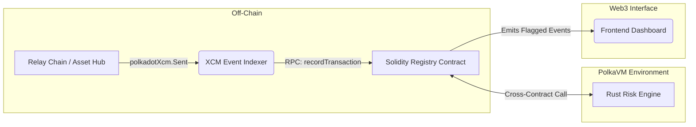

# ParaTrace – Cross-Chain Transaction Monitoring & Compliance Protocol

ParaTrace is a native cross-chain transaction monitoring and automated compliance protocol built for interoperable blockchain ecosystems like Polkadot. It observes XCM (Cross-Consensus Messaging) asset movements, evaluates wallet behaviors, and automatically flags suspicious transactions in real time using a hybrid Solidity and Rust smart contract architecture on the PolkaVM.

---

## 🚀 Deployed Links

- **Frontend Dashboard:** [https://para-trace-rm.vercel.app/](https://para-trace-rm.vercel.app/)
- **Indexer API / Listening Service:** [https://paratrace.onrender.com/](https://paratrace.onrender.com/)
- **Registry Contract (Solidity via pallet-revive):** `0xbA686106E15b9b27407b94Cb51bf734705cAF80a`
- **Risk Engine (Rust/ink! on PolkaVM):** `0x77D5f9f09f02871B918Cb2F5430F9A91004f76c4`

---

## 🚨 The Problem

Modern multi-chain ecosystems allow users to seamlessly move assets across different blockchains. While interoperability unlocks massive liquidity and utility, it introduces critical security blind spots:

* **Cross-Chain Money Laundering ("Chain Hopping"):** Malicious actors hide the origin of stolen funds by rapidly transferring assets across multiple networks using XCM, making the transaction trail incredibly complex to follow.
* **Fragmented Visibility:** Traditional EVM scanners and passive analytics tools are isolated to single chains. They fail to parse native cross-chain text payloads or correlate events spanning multiple networks.
* **Delayed Response Times:** Existing solutions are mostly passive analytics platforms. By the time a suspicious multi-chain route is manually identified, the funds have already moved. 

As transactions occur in seconds, a real-time, cross-chain, automated tracking system natively integrated into the blockchain is an absolute necessity.

---

## 🛡️ The Solution

ParaTrace resolves these blind spots by introducing an **Automated On-Chain Risk Oracle**. Instead of analyzing transactions in isolation, ParaTrace aggregates cross-chain data, calculates behavioral risk safely on-chain, and empowers parachain DeFi protocols to block malicious transactions automatically.

### Architecture & Data Flow



### Core Components

1. **XCM Event Indexer (`indexer/`)**  
   A persistent Node.js service that maintains live WebSocket subscriptions to parachains and the relay chain. It listens natively for XCM transfer events, parses the cross-chain payloads for source/destination/amount metadata, and pushes this data securely to our Registry Contract.

2. **Solidity Registry (`contracts-solidity/`)**  
   The primary on-chain Oracle compiled via `pallet-revive`. It manages highly optimized, gas-packed wallet profiles to track historical behavior. When new indexer data arrives, it serves as the gatekeeper, requesting a risk assessment from the Risk Engine. If a wallet's risk goes beyond a safe threshold, the Registry flags it and emits events.

3. **Rust Risk Engine (`contracts-rust/`)**  
   A stateless `ink!` smart contract running natively on Polkadot’s RISC-V architecture (PolkaVM). It handles the heavy computational multi-factor risk scoring algorithm (evaluating volume, transaction velocity, chain diversity, and interaction with tainted wallets). By keeping this engine stateless with zero storage reads/writes, it evaluates complex XCM risks with near-zero gas overhead.

4. **Frontend Dashboard (`frontend-dashboard/`)**  
   A modern Next.js/React interface plotting the flow of cross-chain assets. It provides real-time visualizations of network status, dynamic risk gauges, and a continuous feed of flagged high-risk wallets for compliance officers or public transparency.

5. **Local Network Testing (Zombienet)**
   To test interoperability quickly, we utilize a lightweight **Zombienet** configuration to spin up a local test environment running a Relay Chain, Asset Hub, and an `eth-rpc` translation node.

---

## ⚙️ Setup & Execution Guide

### Prerequisites
* Node.js (v18+)
* Polkadot binaries & Zombienet installed locally (v0.3.4+)
* `eth-rpc` (Substrate → EVM adapter)

### 1. Start the Local Development Stack (Zombienet)
First, launch the underlying testnet mapping out your Relay chain, Asset Hub, and the EVM adapter (exposed on port 8545):
```bash
cd zombienet
bash start-local-stack.sh
```

### 2. Deploy the Smart Contracts
You must deploy the Rust Risk Engine first, followed by the Solidity Registry so it can link correctly:
```bash
cd contracts-solidity
npm install

# Deploy the compute-heavy Risk Engine (Rust/ink!)
npx hardhat run scripts/deployRiskEngine.ts --network zombienet

# Deploy the Solidity Registry, passing the Risk Engine's address
npx hardhat ignition deploy ignition/modules/ParaTrace.ts \
  --network zombienet \
  --parameters '{"ParaTraceModule":{"riskEngineAddress":"<INSERT_RISK_ENGINE_ADDRESS_HERE>"}}'
```

### 3. Spin up the Event Indexer
Run the background service to aggressively monitor XCM transactions across your local stack:
```bash
cd indexer
npm install
# Make sure your .env has REGISTRY_CONTRACT_ADDRESS matching step 2
npm start
```

### 4. Launch the Dashboard
Fire up the Next.js frontend to monitor the state of the network dynamically:
```bash
cd frontend-dashboard
npm install
npm run dev
```
*Access the dashboard at [http://localhost:3000](http://localhost:3000)*.
